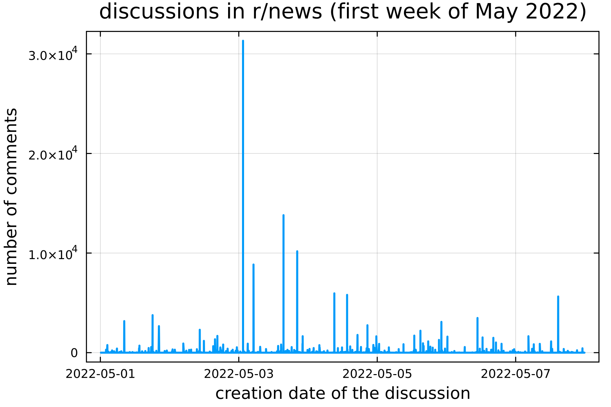

# Estimating the total number of comments on Reddit (2023)

### Question:
How large a sample do we need to estimate the **total number of comments on Reddit** within a **10% error**? What about a **1% error**?

### Short Answer:
As of December 2022, a total of $D \approx 1.9\times10^9$ discussions had been created on Reddit since its foundation in 2005. These discussions generated a total of $C \approx 1.3\times10^{10}$ comments.

In order to estimate $C$ we may try to sample a fraction $p\ll1$ of all the discussions, compute the sum $\hat{c}$ of all the comments in the sampled discussions, and then rescale to obtain our estimate $\hat{C} = \hat{c}/p$. The question is to assess the precision of this estimate.

It turns out that we need a sample fraction $p\approx10^{-5}$ ($Dp \approx 1.9\times 10^4$ discussions) to estimate $C$ within a **10% standard error**. This fraction increases to $p\approx10^{-3}$ ($Dp \approx 1.9\times 10^6$ discussions) in order to achieve a **1% standard error**. (Figure 1)

### Long Answer:
The answer depends on **how heavy-tailed is the distribution of the number of comments per discussion**. See below for a more detailed analysis and the motivation behind this work. An interactive notebook to explore the problem with different datasets is available in the $\mathtt{/notebooks}$ subfolder.

Figure 1: The ratio between the estimated and the true number of comments, as a function of the sampling probability $p$. Each datapoint is obtained by obtaining several independent estimates $[C_1/C,\ldots,C_n/C]$ for each sampling fraction $p$, and then computing the relevant statistical functionals (mean, std, median, quantiles). Dataset: all $1.9\times10^9$ Reddit discussions from 2005 to 2022.

## 1. Motivation

The study of **online social media** depends crucially on the availability of large **representative datasets**. However, many major social media companies are notoriously reticent to grant researchers adequate access to their data.

**Reddit** used to be an exception to this rule, allowing researchers and third-party developers **full access to its Data API**. This led to the release in 2020 of the **Pushift Reddit Dataset** [1], a third-party dataset including **almost all public Reddit data** since the platform foundation in 2005.

The Pushshift Dataset subsequently received monthly updates until March 2023. But then in April 2023 **Reddit famously restricted access to its Data API** [2] and effectively prevented the dataset from being updated any further. Although there have been succesful efforts in recent times to collect Reddit data past March 2023, these new datasets are not as easily accessible.

These circumnstances illustrate the importance of **developing methods to draw inferences** about social media platforms **from small samples**. Thanks to its completeness (on historical data) the Reddit Pushshift dataset provides an excellent source for **controlled subsampling experiments**.

## 2. Scope of this project

Reddit is a social media platform organised as a network of thematic communities, known as *subreddits*, where users engage in discussions. Our aim is to estimate quantities such as the **total number of comments** or the **total score** in the discussions of a given Reddit community over a given period of time. Specifically, we ask **how many discussions it is necessary to sample to obtain an estimate within a prescribed error $\bm{\epsilon}$.**

Despite their simplicity, metrics like the total number of comments and the total score can be good proxies for the **overall activity** of a community, which is an important denominator.

## 3. Estimating the total number of comments

Consider a Reddit community such as r/politics, r/news, r/askreddit, or even Reddit as a whole. Let $D\gg1$ be the number of discussions created in the community during a given period of time. Let $[N_1,\ldots,N_D]$ be the number of comments in each discussion. Then the total number of comments is:

$$ C = \sum_{k=1}^{D} N_k $$

We now assume it is possible to obtain a random sample from the population $[N_1,\ldots,N_D]$, where each discussion is included in the sample with a known probability $p$, independently of all other discussions. In pricinple, this could be achieved e.g. by following a procedure similar to [3,4] where the authors crawled YouTube videos by entering randomly-generated IDs into YouTube's API.

This sampling scheme may be modelled by introducing a family $[\theta_1,\ldots,\theta_D]$ of independent $\mathsf{Bernoulli(p)}$ random variables where either $\theta_k = 1$ or $\theta_k = 0$ depending on whether discussion-$k$ has been included in the sample. The sum of all the comments in the sample is then:

$$ \hat{c} = \sum_{k=1}^{D} \theta_k N_k $$

By definition, the probability of including a discussion in the sample is $\mathbb{P}[\theta_{k} = 1] = p$. Therefore we may estimate the true number of comments as:

$$ \hat{C} = \hat{c}/p $$

This is an unbiased estimate, as $\mathbb{E}[\hat{C}] = C$. The question is to assess its precision. One possible source of concern is that **the distribution $\bm{[N_1, \ldots , N_D]}$ of the number of comments per discussions is heavy-tailed**. Informally, this means that **most discussions receive only a handful of comments, whereas a small but sizeable minority of discussions receives order of magnitude more** (Figure 2). If the sampling probability $p$ is too small, the tail of the distribution will not be sampled appropriately, causing the estimate to be imprecise (Figures 2, 3).

**Figure 2:** Fraction $G_k$ of discussion with more than k comments. Grey curve: all discussion on Reddit from 2005 to 2022. Blue and Orange curves: samples from this population with  sampling probabilities $p=10^{-4}$ and $p=10^{-6}$. If $p$ is too small, the tail of the distribution is not sampled adequately, causing the estimate to be imprecise.

## 4. Precision of the estimate

Consider the ratio between the in-sample estimate $\hat{C}$ and the true number of comments $C$:

$$ \boxed{\hat{r} = \hat{C}/C} $$

We have seen that $\mathbb{E}[\hat{r}]=1$ as the estimate $\hat{C}$ is unbiased. **The standard deviation of $\bm{\hat{r}}$ can be used to assess the precision of our estimate**. We can express $\mathrm{std}[\hat{r}]$ as a function of the sampling probability $p$ or as a function of the expected sample size $d=pD$ where $D$ is the population size i.e. the total number of discussions. Both choices have their advantages, as illustrated in the next section.

#### As a function of the sampling probability $p$
A straightforward computation shows that for a sampling probability $p\ll 1$ we have:

$$ \mathrm{std}[\hat{r}] \approx \frac{Q}{C\sqrt{p}} $$

So the precision of the estimate for a given sampling probability $p$ depends on the following ratio, where as usual $N_k$ is the number of comments in the $k$-th discussion:

$$ \frac{Q}{C} = \frac{\sqrt{\sum\limits_{k=1}^{D} N_k^2}}{\sum\limits_{k=1}^{D} N_k} $$

Clearly $Q \le C$ by Jensen's inequality, and we shall see below that $Q\ll C$ in most of the largest subreddits over long observations periods. 

#### As a function of the expected sample size $d=Dp$

Here it proves convenient to introduce the $l^r$ norm of the distribution $[N_1,\ldots,N_D]$:

$$ \Vert N \Vert_r = \left[\frac{1}{D}\sum_{k=1}^{D}N_k^r \right]^{1/r} $$

Since $Q = \sqrt{D} \Vert N \Vert_2$ and $C = D\Vert N \Vert_1$ we find:

$$ \mathrm{std}[\hat{r}] \approx \frac{\Vert N \Vert_2}{\Vert N \Vert_1 \sqrt{d}} $$

## 5. A best-case and a worst-case scenario

We now study the precision of the estimate in two limit cases. 

### Best-case scenario: very light tails

The **best case scenario** occurs when **all discussions have approximately the same number of comments**, so that the distribution of $[N_1, \ldots , N_D]$ has little dispersion (i.e. light tails) around its average. In this case it is straightforward to show that $\Vert N \Vert_2 \approx \Vert N \Vert_1$ so that the standard deviation of $\hat{r}$ is:

$$ \mathrm{std}[\hat{r}] \approx \frac{1}{\sqrt{d}} $$

So in this case **the precision of the estimate depends essentially on the absolute sample size $d$ rather than the sampling probability $p$**. That is: the estimate will be precise even if $p$ is small, as long as $d$ is large in absolute terms.

### Worst-case scenario: very heavy tails

The **worst-case scenario** occurs when the distribution of $[N_1, \ldots , N_D]$ is **extremely skewed**. This may be relevant e.g. if the data is collected over a relatively short observation period (e.g. a week), so that one single discussion (e.g. with $5\times10^4$ comments) towers over all other discussions (Figure 3). Then $Q\approx C$ as both sums are dominated by the same largest contributions:

$$ C = \sum_{k=1}^{D}N_k \approx N_{\max} \qquad\qquad Q^2 = \sum_{k=1}^{D}N_k^2 \approx N_{\max}^2 $$

Take $N_k=2^k$ for a simple artificial example where $Q/C \approx 3^{-1/2}$ when $D\gg 1$. The standard deviation of $\hat{r}$ in this particular case is then:

$$\mathrm{std}[\hat{r}] \approx \frac{1}{\sqrt{3p}}$$

This shows that **the estimate is very imprecise if the sampling probability $p$ is not large enough, even if the absolute sample size $d \approx Dp$ is large in absolute terms**. The reason is that a small $p$ gives a poor sample of the tail of the distribution, which is where most of the comments are to be found (Figure 2).

**Figure 3:** Activity during the first week of May 2022 in the community r/news. There are $D \approx 5\times10^3$ discussions in this dataset. But the single largest discussion with $3\times10^4$ comments accounts for $17\%$ of the total comments. 

## 6. Example: the largest 500 Reddit communities of 2022

We now illustrate the above discussion by analysing **the largest 500 subreddits from January 2022 to December 2022**. These are only about **0.5% of all active subreddits**, but account for **45% of all the comments** posted in 2022, in a striking manifestation of the **Pareto Principle**.

Recall now from Section 4 that the variance of the ratio $\hat{r} = \hat{C}/C$ between the estimated and the true number of comments is:

$$ \mathrm{std}[\hat{r}] \approx \frac{\Vert N \Vert_2}{\Vert N \Vert_1 \sqrt{d}} $$

So the precision of the estimate depends on the ratio $\Vert N \Vert_2 / \Vert N \Vert_1$ between the $l^2$ and the $l^1$ norms of the distribution of the number of comments per discussions $[N_1, \ldots , N_D]$. It turns out that the situation is somehow intermediate between the best-case and the worst-case scenarios. That is:

- The distribution of  $[N_1, \ldots , N_D]$ is heavy-tailed in all the communities under consideration.
- On the other hand the ratio $\Vert N \Vert_2 / \Vert N \Vert_1$ is not too large.

Figure ? shows that typically we have $2 \le \Vert N \Vert_2 / \Vert N \Vert_1 \le 10$ with peaks around $15$. Therefore the required sample size $d$ to estimate the total number of comments within a standard error $\epsilon$ is:

- Between $d \approx 5 \times 10^2$ and $d \approx 5 \times 10^3$ for a **10% standard error** (Figure ?A).
- Between $d \approx 1 \times 10^3$ and $d \approx 1 \times 10^5$ for a **5% standard error** (Figure ?B).
- Between $d \approx 1 \times 10^4$ and $d \approx 5 \times 10^5$ for a **1% standard error** (Figure ?C).

In terms of the sampling probability $p$ we need:
- $p < 0.05 $ for a **10% standard error** (Figure ?A).
- $0.05 < p < 0.2 $ for a **5% standard error** (Figure ?B).
- $p > 0.4 $ for a **1% standard error** (Figure ?C).

In conclusion: **an estimate within a 10% or a 5% error seem within reach** in most subreddits during the 12-month period considered. Whereas **a 1% error may potentially be out of reach.**

**Figure 4:** The scaling constant $\Vert N \Vert_2 / \Vert N \Vert_1$ in the largest 500 subreddits of 2022. Large values of $\Vert N \Vert_2 / \Vert N \Vert_1$ require a larger sample size to achieve a desired precision.

**Figure 5:** Sampling size required to achieve a desired standard error (standard error = standard deviation of the ratio $\hat{r}$) in the largest 500 subreddits of 2022.

**Figure 6:** **Figure 5:** Sampling probability required to achieve a desired standard error (standard error = standard deviation of the ratio $\hat{r}$) in the largest 500 subreddits of 2022.

## 7. Deviations from normality

So we have seen that the situation is not too dire for many Reddit communities. Still, the estimate $\hat{r}=\hat{C}/C$ does have a large variance when $[N_1, \ldots , N_D]$ is heavy-tailed (as in the case of most subreddits) and the sampling probability $p$ is not large enough (Figure 1). Such a large variance indicates a **failure of the normal approximation from the Central Limit Theorem**. In this case $\hat{r}$ has a skewed distribution, as the estimate is very sensitive to the particular choice of the sample (Figure 7).

  
  

Figure 7: Distribution of the ratio $\hat{r} = \hat{C}/C$ between the estimated and the true number of comments, for different sampling probabilities $p$ over $n=10^6$ repetitions. Whereas $\hat{r}$ = 1 on average for all sampling probabilities $p$, the distribution gets progressively skewed to the right as the $p$ gets smaller. This strong deviation normality is particularly visible in the quantile-quantile plot. Dataset: all $1.9\times10^9$ Reddit discussions from 2005 to 2022.

## 9. A quick-and-dirty error estimate

We have seen in Section 4 that the precision of the estimate is given by the standard deviation of the ratio $\hat{r}$:

$$ \mathrm{std}[\hat{r}] \sim \frac{Q}{C\sqrt{p}} $$

We recall that $C$ and and $Q$ were defined as:

$$ C = \sum_{k=1}^{D}N_k \qquad\qquad Q^2 = \sum_{k=1}^{D}N_k^2 $$

However, these two sums run over the entire population $[N_1,\ldots,N_D]$ whreas we only have access access to a smaller sample $\mathcal{S} \subset [N_1,\ldots,N_D]$. The ideal solution would be to collect several independent samples $(\mathcal{S}_1,\ldots,\mathcal{S}_n)$, compute $\hat{r}$ for each sample, and then estimate the standard deviation. In practice, this is a non-starter as we may not have the resources to obtain several independent samples. A more realistic alternative is to generate $(\mathcal{S}_1,\ldots,\mathcal{S}_n)$ from the only available sample $\mathcal{S}$ by using a resampling algorithm such as the **bootstrap**.

But there is an even simpler approach to obtain a quick-and-diryy estimate of $\mathrm{std}[\hat{r}]$ which only requires the in-sample versions of $C$ and $Q$:

$$ \hat{c} = \sum_{k=1}^{D} \theta_k N_k \qquad\qquad \hat{q}^2 = \sum_{k=1}^{D}\theta_k N_k^2 $$

If the sample size $d=pD$ is not too small we may hope to use the approximations $C \approx \hat{c}/p$ and $Q\approx \hat{q}/\sqrt{p}$. This leads to the following **in-sample approximation for the standard error**:

$$ \boxed{\mathrm{std}[\hat{r}] \approx \frac{\sqrt{\sum\limits_{k=1}^{D} \theta_k N_k^2}}{\sum\limits_{k=1}^{D} \theta_k N_k}} $$

This turns out to be a slight **underestimate of the true variance**, but **the approximation is not too bad if the sampling probablity $p$ is not extremely small** (Figure 8). In any case, a large in-sample variance (e.g. $0.2$ or $0.3$) is an indicator that $p$ is too small.

Figure 8: In-sample approximation for the variance of the ratio $\hat{r}$ as a function of the sampling probability $p$. Each data point is obtained by obtaining several independent samples for each $p$, and then computing mean and standard deviation of the in-sample variances. Dataset: all $1.9\times10^9$ Reddit discussions from 2005 to 2022.

## References

[1] - J. Baumbgartner, S. Zannettou, B. Keegan, M. Squire, J. Blackburn - *The Pushshift Reddit Dataset.* https://arxiv.org/abs/2001.08435   
[2] - An update regarding Reddit’s API. https://old.reddit.com/12qwagm.   
[3] - E. Zuckerman. *How big is Youtube?* https://ethanzuckerman.com/2023/12/22/how-big-is-youtube/   
[4] - R. McGrady, K. Zheng, R. Curran, J. Baumgartner, and E. Zuckerman. *Dialing for videos: A random sample of YouTube*. Journal of Quantitative Description: Digital Media, 3, 2023.

